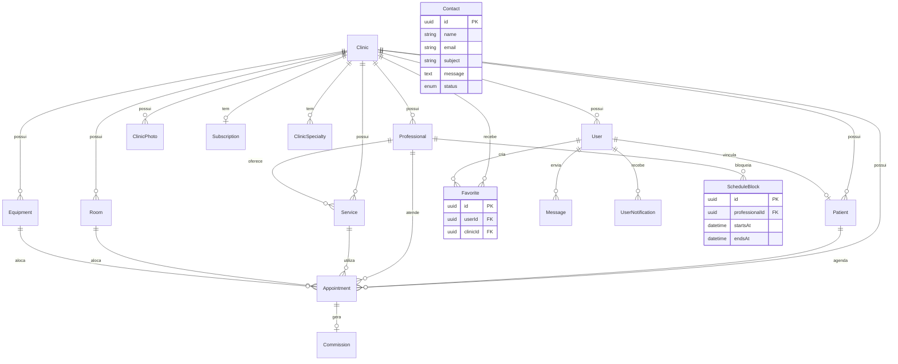
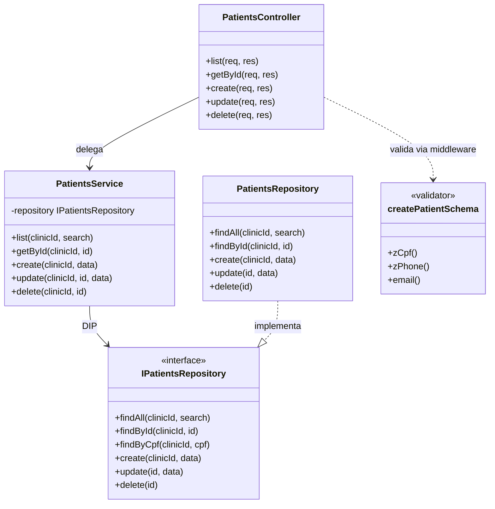
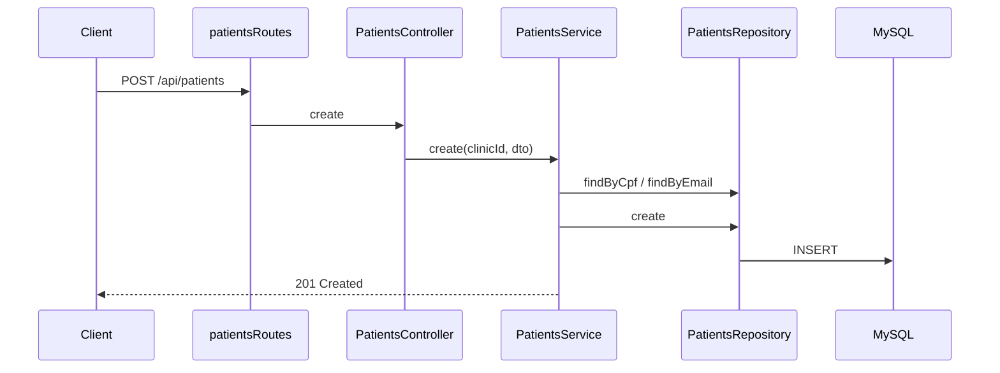

# Modelagem — CronoCita

Documentação acadêmica de modelagem de dados e arquitetura de classes do sistema.

Schema completo: [`backend/prisma/schema.prisma`](../backend/prisma/schema.prisma)

---

## DER — Diagrama Entidade-Relacionamento

### Entidades principais

| Entidade | Descrição |
|---|---|
| **Clinic** | Clínica multi-tenant (CNPJ, endereço, rating, identidade visual) |
| **User** | Conta global com role (SUPER_ADMIN, CLINIC_ADMIN, PROFESSIONAL, PATIENT) |
| **Patient** | Prontuário do paciente por clínica (CPF único por clínica) |
| **Professional** | Profissional vinculado a uma clínica |
| **Appointment** | Agendamento com status, sala, equipamento e avaliação |
| **Service** | Serviço oferecido (duração, preço, profissional opcional) |
| **Favorite** | Clínica favoritada por um paciente |
| **Contact** | Mensagem do formulário Fale Conosco |
| **ScheduleBlock** | Bloqueio de horário na agenda do profissional |

---

## Diagrama de Classes — Módulo Pacientes (SOLID)

Exemplo de **SRP** (cada camada uma responsabilidade) e **DIP** (service depende de interface, não de Prisma).

### Princípios SOLID aplicados

| Princípio | Onde | Evidência |
|---|---|---|
| **S — Single Responsibility** | Camadas Routes → Controller → Service → Repository | Cada classe tem uma única razão para mudar |
| **D — Dependency Inversion** | `IPatientsRepository`, `IServicesRepository`, `NotificationProvider` | Services recebem interfaces via construtor |
| **O — Open/Closed** | `NotificationProvider` | Novos providers (Evolution, Twilio) sem alterar regra de negócio |

---

## Fluxo CRUD Pacientes (referência para testes)

